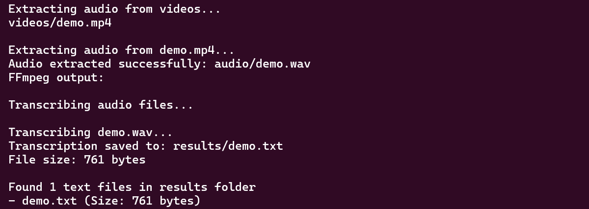

# MassVideoTranscriber

Mass Video Transcriber is a Python script that processes video files to extract audio, transcribe the audio using the Whisper model, and save the transcriptions as text files. The script preserves the directory structure of the input files in the output directories.



## Features

- Extracts audio from video files.
- Transcribes audio files using the Whisper model.
- Saves transcriptions as text files.
- Preserves directory structure of input files.

## Installation

1. Clone the repository:

    ```sh
    git clone https://github.com/yourusername/MassVideoTranscriber.git
    cd MassVideoTranscriber
    ```

2. Install the required dependencies:

    ```sh
    pip install -r requirements.txt
    ```

## Dependencies

- [Whisper](https://github.com/openai/whisper)
- [FFmpeg](https://ffmpeg.org/)
- Python 3.6 or higher

## Usage

1. Place your video files in the `videos` directory.

2. Run the script:

    ```sh
    python text-from-video.py
    ```

    To skip video processing and only transcribe existing audio files in the [audio](http://_vscodecontentref_/#%7B%22uri%22%3A%7B%22%24mid%22%3A1%2C%22fsPath%22%3A%22c%3A%5C%5CUsers%5C%5Cjerem%5C%5CProjects%5C%5CMassVideoTranscriber%5C%5Caudio%22%2C%22_sep%22%3A1%2C%22path%22%3A%22%2Fc%3A%2FUsers%2Fjerem%2FProjects%2FMassVideoTranscriber%2Faudio%22%2C%22scheme%22%3A%22file%22%7D%7D) directory, use:

    ```sh
    python text-from-video.py processaudio
    ```

## Folder Structure

- **videos**: Directory containing input video files.
- **audio**: Directory for storing extracted audio files.
- **results**: Directory for storing transcription text files.

## Example

```sh
python text-from-video.py
```

Licensed under Creative Commons CC0 1.0 Universal license. Do whatever you want with this. 